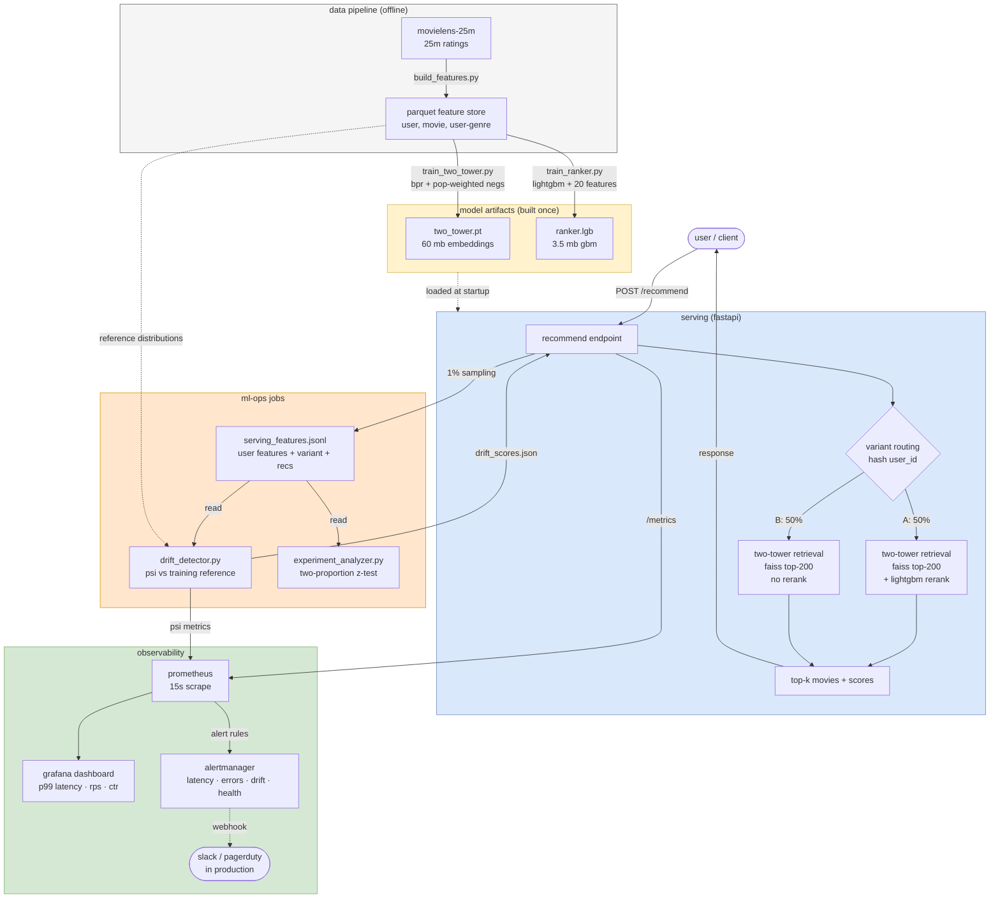

# architecture

end-to-end system for serving, observing, experimenting on, and detecting drift in a two-stage movie recommender.

## three concerns, one stack

**serving** (blue). request enters fastapi, gets routed to one of two variants by deterministic hash. variant A applies the full two-tower + lightgbm rerank. variant B uses two-tower retrieval alone — the control we test against.

**observability** (green). every request increments counters and observes histograms. prometheus scrapes `/metrics` every 15 seconds. grafana visualizes. four alert rules in alertmanager catch latency spikes, error rate spikes, model-load failures, and feature drift.

**ml-ops jobs** (orange). 1% of serving requests log their features to disk. an offline drift detector reads the log, computes population-stability index (psi) against a held-out training reference, writes scores back. the api re-exposes those scores as prometheus gauges, closing the observability loop. an a/b analyzer reads the same log, joins with val-set ground truth, runs a two-proportion z-test on per-variant ctr.

## data lifecycle

1. **offline** (one-time, on hardware change or weekly retraining): movielens-25m raw → `build_features.py` → parquet feature store → `train_two_tower.py` produces `two_tower.pt` → `train_ranker.py` consumes that and produces `ranker.lgb`. all three steps run from one command each.

2. **online** (continuous): api loads both checkpoints at startup, ~33s. each request retrieves 200 candidates via faiss, optionally reranks with lightgbm, returns top-k. sub-millisecond per request after warmup.

3. **observation** (continuous): metrics scraped every 15s. dashboards refresh every 10s. alerts evaluate every 30s.

4. **drift check** (periodic, in production would be cron): drift detector runs nightly on the most recent 24h of serving log, comparing distributions to training reference. results pushed into the same prometheus pipeline.

## numbers worth knowing

| | value | source |
|---|---|---|
| recall@10 (two-tower + ranker) | 0.0514 | held-out val, 1000 users |
| recall@10 lift vs popularity | +67% | same |
| recall@10 lift over retrieval-only | +16% | same |
| p99 latency (sequential) | 11ms | host benchmark, 100 reqs |
| p99 latency (concurrent, c=10) | 25ms | http load, 500 reqs |
| max sustainable throughput | 725 req/s | single process, c=10 |
| a/b test result (variant A vs B) | +11.8% ctr, p=0.003 | 96k log entries |
| drift detection threshold | psi > 0.25 | alertmanager rule |
| docker image | 5.4 gb | multi-stage, includes torch |
| feature lookup load time | 32s | one-time, at startup |

## what's not done (yet)

- horizontal scaling: single uvicorn process. real deployment uses 4-8 workers per container + horizontal pod scaling.
- ann index swap at scale: `IndexFlatIP` is exact, suitable for ≤1m items. swap to `IndexHNSWFlat` for ≥10m.
- sequential / session features in the ranker. only static user+movie aggregates currently.
- model retraining pipeline. checkpoints are static; production retrains on a schedule informed by drift signals.

